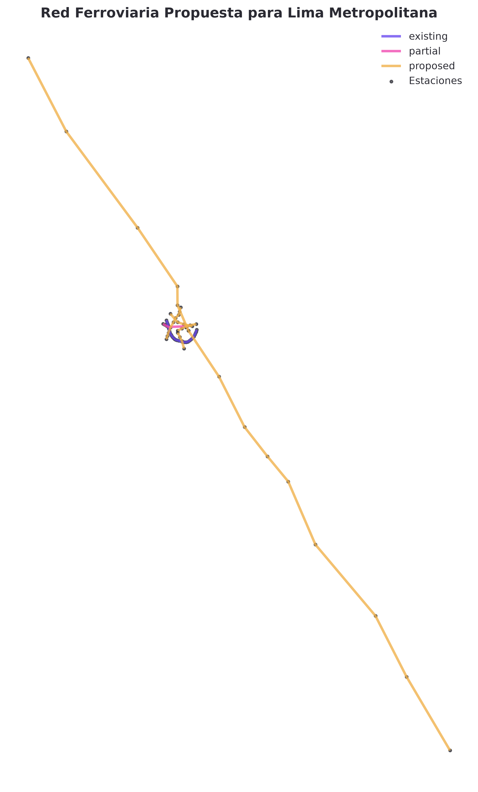
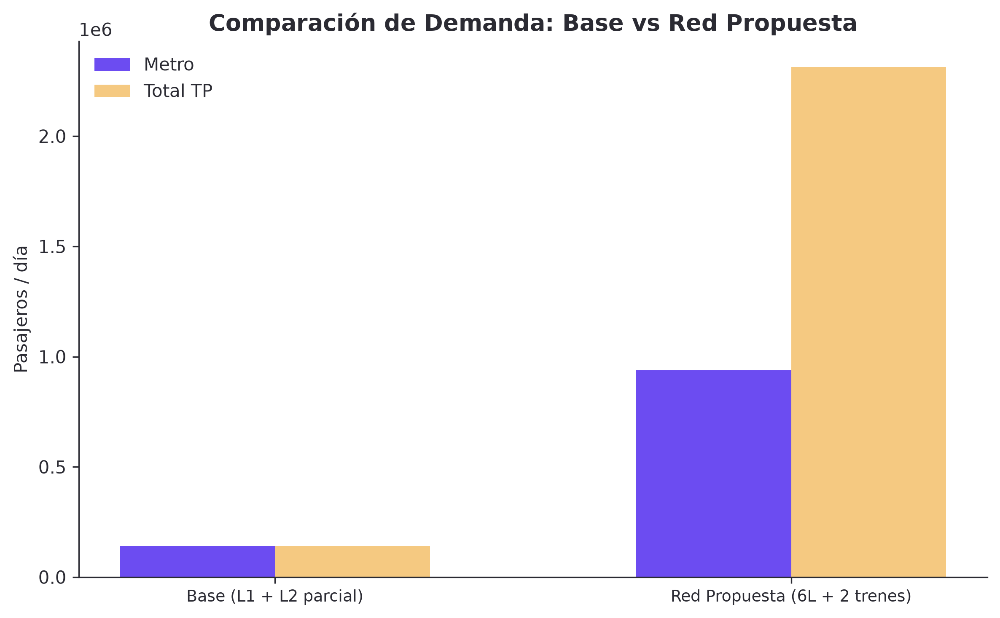
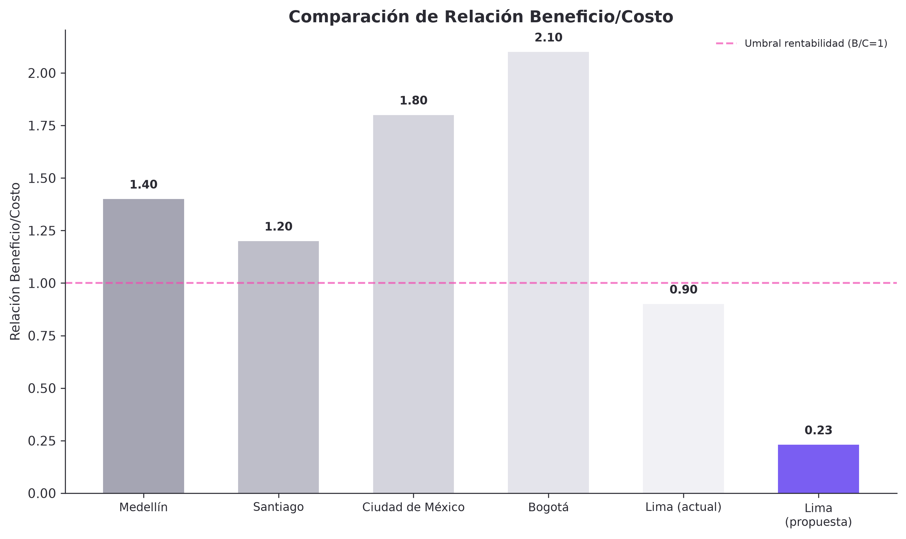
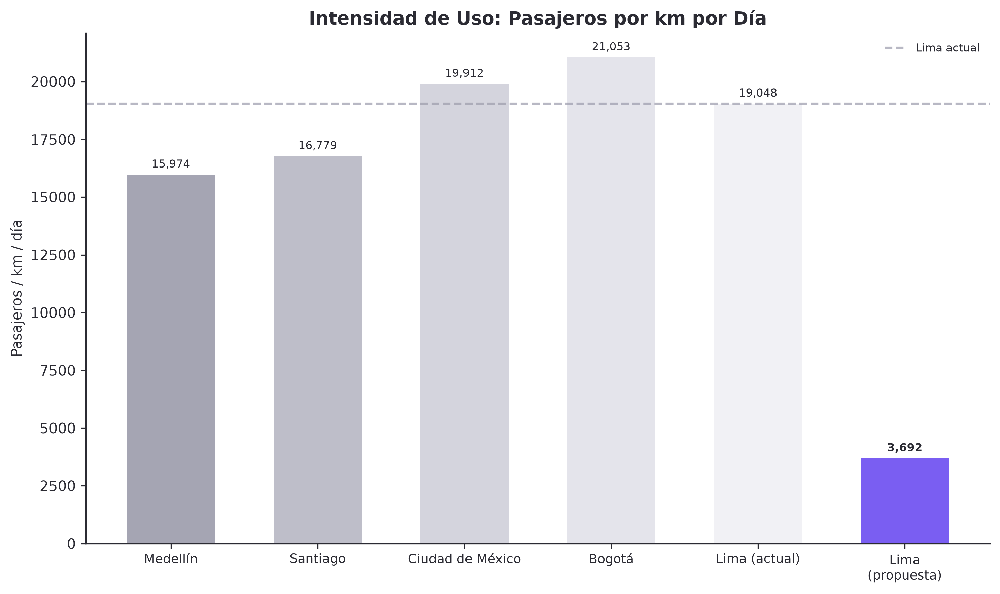
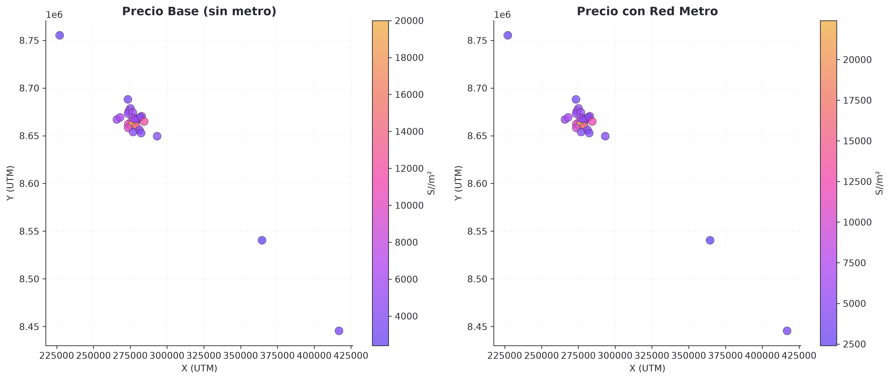

# Evaluación de la Red Ferroviaria Ampliada de Lima


Impacto potencial de las nuevas líneas de metro y trenes de cercanías (propuesta de red ampliada 2026) en una megaciudad de 11+ millones de habitantes.



## Tabla de contenidos

- [Objetivo](#objetivo)
- [Resultados clave](#resultados-clave)
- [Metodología](#metodología)
- [Procedencia de datos](#procedencia-de-datos)
- [Limitaciones](#limitaciones)
- [Cómo reproducir](#cómo-reproducir)

## Objetivo

Cuantificar la demanda potencial, el impacto en movilidad, la rentabilidad socioeconómica y el efecto territorial de la red propuesta (6 líneas de metro + 2 trenes de cercanías: Lima–Ica y Tren del Norte), comparándola con el escenario base (Línea 1 + Línea 2 parcial) y con casos análogos internacionales (Medellín, Santiago, CDMX, Bogotá).

## Resultados clave

**72 estaciones** (29 existentes, 6 parciales, 37 propuestas) sobre una red de **627 km**, evaluadas con modelos de elección modal (logit multinomial), distribución gravitatoria doblemente restringida y análisis costo-beneficio a 30 años.

| Indicador | Valor | Nota |
|-----------|-------|------|
| Demanda metro red completa | **938,264 pax/día** | [ESTIMADO por modelo logit + gravitatorio] |
| Validación Línea 1 | **88.2%** | Contra aforo real ATU (700K/día) |
| Horas ahorradas/día | **1,041,559 horas** | [ESTIMADO por modelo de demanda] |
| Vehículos retirados | **289,322** | Tasa ocupación 2.0 pax/veh |
| Relación B/C (red completa) | **0.23** | Costos de referencia CAF/BID |
| Plusvalía total del suelo | **S/754 millones** | [ESTIMADO por analogía con CDMX/Bogotá] |

### Demanda

| Escenario | Metro (pax/día) | Tren (pax/día) | Total TP |
|-----------|:--------------:|:--------------:|:--------:|
| Base (L1 + L2 parcial) | 140,335 | 0 | 140,335 |
| Red completa (6L + 2 trenes) | **938,264** | 1,376,311 | **2,314,576** |

El modelo estima 617,686 pax/día para el corredor de la Línea 1, un 88.2% del aforo real de 700K pax/día reportado por la ATU.



### Impacto en congestión y costo-beneficio

La red completa transferiría **578,644 viajes/día desde el auto** y ahorraría **1,041,559 horas/día** (≈ US$1.03B/año solo en tiempo), con **38,576 vehículos menos en hora punta**.

**Conclusión principal:** la red completa (US$46,050 millones) no es económicamente viable como proyecto único (B/C = 0.23 por debajo del umbral de 1.0). Las líneas de metro individuales alcanzan B/C de 0.14 y los trenes de cercanías 0.43. Se recomienda construcción por fases, priorizando la Línea 3 (eje norte-sur) y el Tren Lima–Ica, con integración tarifaria como requisito previo.

| Componente | Beneficio anual |
|-----------|:--------------:|
| Ahorro de tiempo | S/ 3,802M |
| Reducción accidentes | S/ 253M |
| Reducción CO₂ | S/ 32M |
| Ahorro combustible | S/ 760M |
| Ahorro operación buses | S/ 446M |
| **Total anual** | **S/ 5,293M** |

VAN Beneficios (30 años, 10%): S/ 49,899M · VAN Costos (inversión + O&M): S/ 218,571M · **B/C = 0.23**



### Benchmarking internacional

| Ciudad | Pax/km/día | B/C | Integración tarifaria |
|--------|:----------:|:---:|:--------------------:|
| Medellín | 15,974 | 1.40 | Full |
| Santiago | 16,779 | 1.20 | Full |
| CDMX | 19,912 | 1.80 | Parcial |
| Bogotá (BRT) | 21,053 | 2.10 | Full |
| **Lima actual** | **19,048** | **0.90** | **None** |
| **Lima propuesta** | **3,692** | **0.23** | **Propuesta** |

Lima actual ya tiene una intensidad de uso comparable a CDMX y superior a Santiago (19,048 pax/km/día). El problema de la propuesta no es la demanda actual sino la **extensión**: al triplicar la red a 627 km, la intensidad caería a 3,692 pax/km/día, la más baja de todos los comparables.



### Valorización del suelo

La red generaría una plusvalía total estimada de **S/754 millones** (US$204M), con una prima promedio de **3.4%** en zonas a menos de 800m de una estación. Los mayores beneficios se concentran en Miraflores/San Isidro, San Borja/Surco y Lima (Cercado).



## Metodología

```
Fase 1: Preparación GIS → Fase 2: Demanda → Fase 3: Impactos → Fase 4: Benchmarking
```

1. **Geoprocesamiento**: buffers de 800m, red OSM, 27 zonas de transporte (buffers + asignación por proximidad).
2. **Elección modal**: logit multinomial con 4 modos (auto, bus, metro, tren), calibrado con parámetros de literatura internacional.
3. **Distribución de viajes**: modelo gravitatorio doblemente restringido (IPF), vectorizado sobre matrices de tiempo haversine compartidas.
4. **Costo-beneficio**: VAN a 30 años con tasa de descuento del 10%, costos de referencia CAF/BID (US$150M/km metro, US$50M/km tren).
5. **Benchmarking**: comparación con datos oficiales de Medellín, Santiago, CDMX y Bogotá.

## Procedencia de datos

| Variable | Estado | Fuente / Método |
|----------|--------|-----------------|
| Población por distrito | **REAL** | INEI Censo 2017 — `libro_poblacion_2017.pdf` (115 distritos del corredor Lima–Ica) |
| Empleo por zona | ESTIMADO | Población INEI 2017 × tasa empleo/población específica por distrito. No existe PEA oficial distrital procesable. |
| Límites distritales | **REAL** | INEI 2017 (vía MINAM GeoServer). |
| Estaciones de metro | **REAL** | Coordenadas verificadas con OSM y documentación oficial L1/L2. L3–L6 y trenes: propuestas estimadas. |
| GTFS (rutas, horarios) | **SINTÉTICO** | ATU no publica feed GTFS público. Generado desde estaciones definidas. |
| Red vial (OSM) | **REAL** | OpenStreetMap vía OSMnx (113K nodos). |
| Tiempos de viaje | ESTIMADO | Haversine × factor congestión + velocidades medias. Sin routing real. |
| Demanda de líneas propuestas | [ESTIMADO] | Logit multinomial + gravitatorio doblemente restringido. |
| Plusvalía del suelo | [ESTIMADO] | Modelo hedónico simplificado con tasas de referencia internacional. |
| Benchmarking | **REAL** | Datos oficiales de Medellín, Santiago, CDMX, Bogotá. |

## Limitaciones

- **GTFS sintético**: la ATU no publica feed GTFS; rutas y horarios se generan desde estaciones definidas.
- **Escenario base como cota inferior de demanda metro**: modela solo L1 + L2 parcial (35 estaciones), por lo que subestima el aforo real de la L1. La calibración se valida sobre el corredor L1 en la red completa (88.2%).
- **Matriz origen-destino sintética**: no se usó la Encuesta Domiciliaria de Viajes JICA (última disponible: 2012); los viajes se distribuyen por modelo gravitatorio.
- **Tiempos de viaje estimados**: haversine con factor de congestión, no routing real sobre el grafo OSM.
- **Empleo por zona estimado**: tasas empleo/población por distrito ante la ausencia de PEA oficial distrital procesable.
- **Costos basados en promedios regionales CAF/BID**, no en estudios de factibilidad detallados.
- **Demanda de líneas propuestas no validable por definición**: L3–L6 y trenes no existen; su demanda es intrínsecamente estimada.
- No se incluyen efectos de aglomeración económica, beneficios de desarrollo urbano ni integración tarifaria explícita.

## Cómo reproducir

```bash
pip install -r requirements.txt

# Fases 1-4 (generan outputs/figures, data/processed/*.csv, informe)
python -m src.phase1_pipeline
python -m src.phase2_pipeline
python -m src.phase3_pipeline
python -m src.phase4_pipeline

# Tests de integridad y reproducibilidad
python -m pytest tests -q

# Dashboard interactivo
streamlit run src/dashboard.py
```

El informe completo está en `outputs/informe_final.md` y las cifras de resultados se generan directamente desde `data/processed/`.
